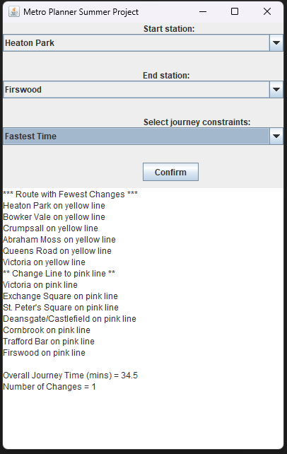

# Metro Planner – Manchester



A small summer university project: a desktop GUI that plans journeys on the Manchester Metrolink.  
Given a CSV of the network (stations, line colours, and travel times), it finds routes either for **fastest total time** or **fewest line changes** and prints a readable itinerary.

---

## Features

- 🗺️ **Interactive GUI (Swing)** – choose start and end stations from dropdowns and pick a routing goal (Fastest Time / Least Changes).
- ⚙️ **Two Dijkstra-based searches**  
  - **Fastest Time**: minimizes total minutes (line changes add a small penalty).  
  - **Least Amount of Changes**: minimizes colour/line changes; ties are broken by total time.
- 📄 **Simple data file** – one CSV in the same folder with: `Start, End, LineColour, Minutes`.
- 🔁 **Undirected weighted graph** – edges are created in both directions so travel times are symmetric.

---

## How it works (quick overview)

- The GUI loads station names and the network graph from `Metrolink_times_linecolour.csv` (must be in the same folder). :contentReference[oaicite:3]{index=3}  
- The graph is built from the CSV where each row is an edge: **Start Station**, **End Station**, **Line Colour**, **Minutes Taken**. :contentReference[oaicite:4]{index=4}  
- Routing uses two variants of **Dijkstra’s algorithm**:
  - `shortestTime(...)` — minimize minutes (changing line colours adds a small fixed time). :contentReference[oaicite:5]{index=5}
  - `leastAmountOfChanges(...)` — minimize number of colour changes; if tied, take the faster one. :contentReference[oaicite:6]{index=6}

By default, a line change adds **2 minutes** (adjustable in code). :contentReference[oaicite:7]{index=7}

---

## Run it locally

> Requires **Java 17+** (records are used).

```bash
# From the project folder:
javac *.java
java MetroGui


# To update javadocs: 
javadoc -d javaDocs MetroGui.java SearchWithSpec.java MetroGraph.java