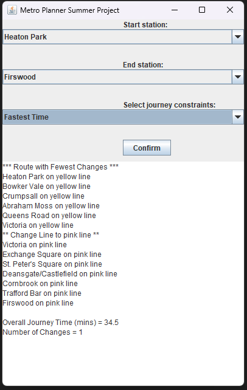

# Metro Planner for Manchester



A summer university project: a desktop GUI that plans journeys on the Manchester Metrolink.  
Given a CSV of the network (stations, line colours, and travel times), it finds routes for **fastest total time** or **fewest line changes** and prints a readable itinerary.

---

## Features

- **Interactive GUI (Swing).** Choose start and end stations and a routing goal.
- **Two Dijkstra-based searches**
  - **Fastest time.** Minimizes total minutes (line changes add a small penalty).
  - **Fewest changes.** Minimizes number of colour/line changes; ties broken by time.
- **Simple data file.** One CSV in the same folder: `Start, End, LineColour, Minutes`.
- **Undirected weighted graph.** Edges added in both directions.

---

## How it works

- The GUI loads station names and the network graph from `Metrolink_times_linecolour.csv` (in the same folder).
- The graph is built from the CSV where each row is an edge: **Start Station**, **End Station**, **Line Colour**, **Minutes Taken**.
- Routing uses two variants of **Dijkstra's algorithm** (one for time, one for line-change count).
- By default, a line change adds **2 minutes** (adjustable in code).

---

## Run it locally

> Requires **Java 17+**.

```bash
# From the project folder:
javac *.java
java MetroGui
```

---

## Customize

- **Change penalty for switching lines:** tweak the "change time" constant in the code (default `2.0` minutes).
- **Use your own network:** replace the CSV with your data in the same four-column format.

---

## Javadocs

The generated Javadoc is included in this repo under **`javaDocs/`** (open `javaDocs/index.html` locally).  
To regenerate locally:

```bash
javadoc -d javaDocs MetroGui.java SearchWithSpec.java MetroGraph.java
```
